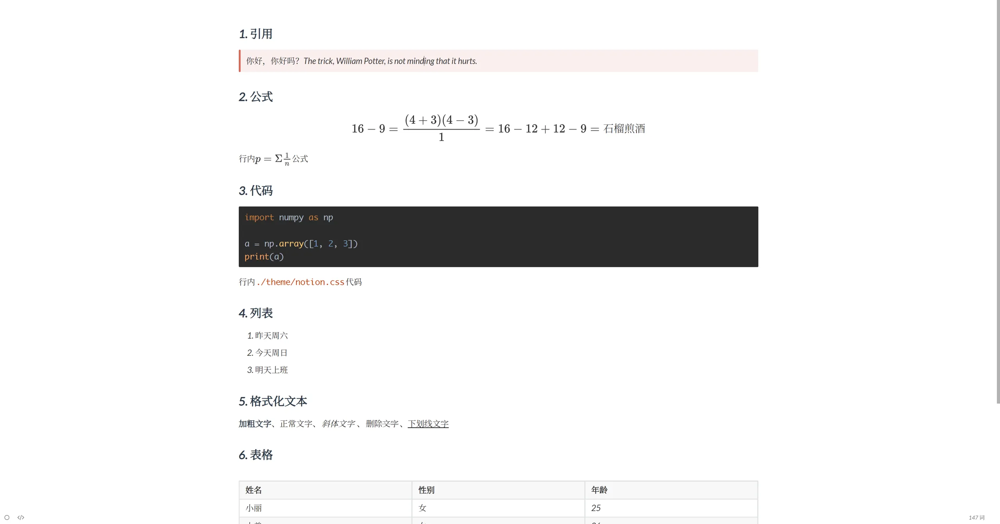
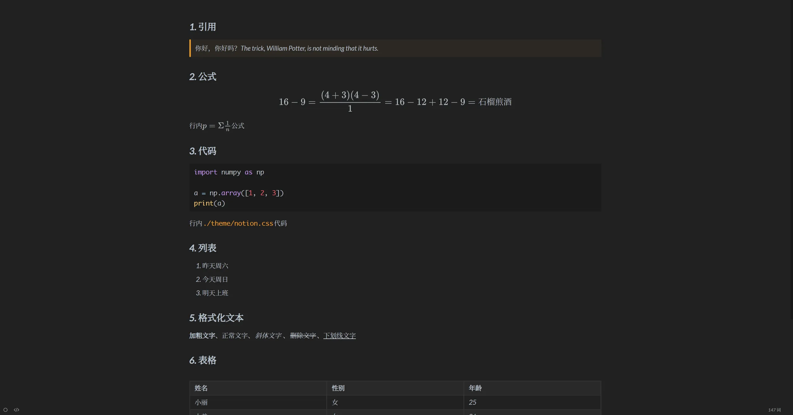
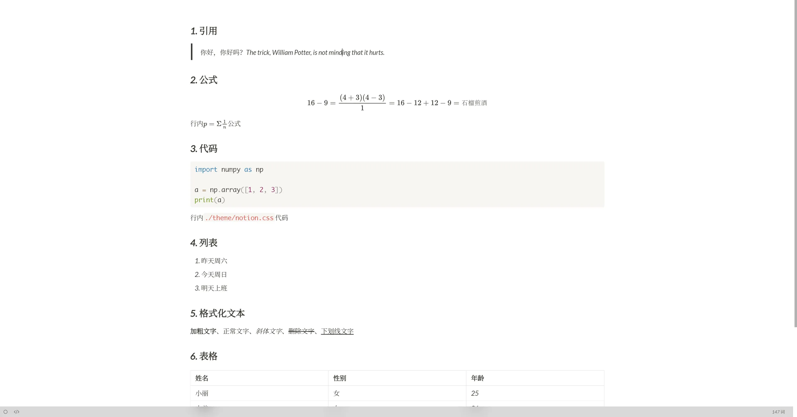
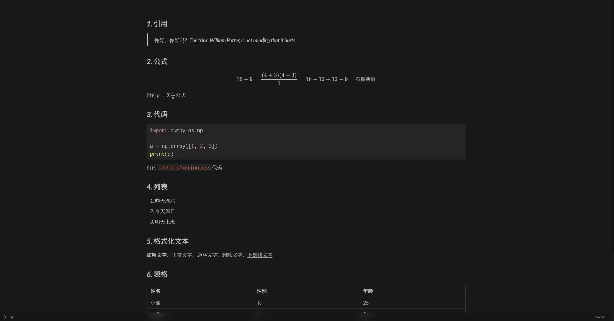

> 几套Typora主题，基于[Notion for Typora](https://github.com/adrian-fuertes/typora-notion-theme)和[Drake](https://github.com/liangjingkanji/DrakeTyporaTheme)，主要改动为修改字体和字体大小

### 使用方法

将`./theme`文件夹下内容复制到Typora主题目录下，重启Typora

### 样例展示

1. Drake

2. DrakeBlack

3. DrakeMeterial

4. Notion

5. NotionDarker

